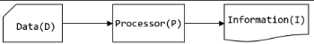
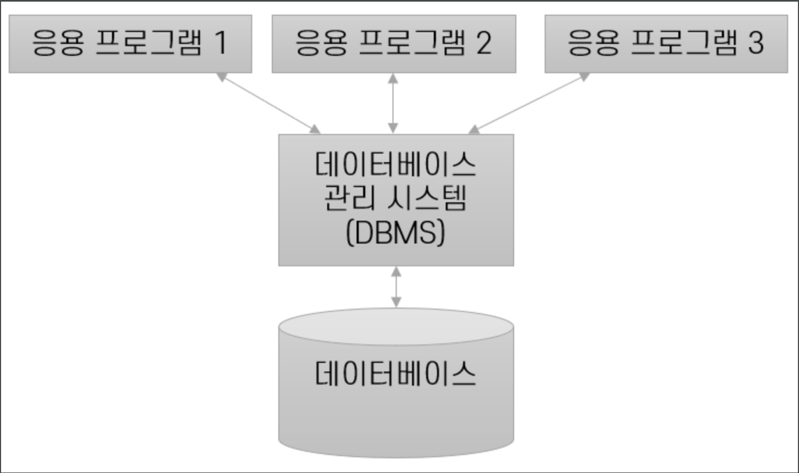

= 데이터베이스 개요

=== 데이터베이스란,데이터의 집합체

---

* 데이터(Data), 정보(Information)

** 데이터(Data) : 관찰 및 측정을 통해 수집된 사실(fact), 값(value)

*** fact / value 가 가질 수 있는 값 : Numeric, String

** 정보(Information) : 의사 결정 할 수 있게하는 지식 => 유효한 데이터의 해석, 데이터의 관계

*** 데이터간의 상호관계

*** I = P(D)  -> Information = Processing( Data )

*** 데이터의 값을 Processing 을 통해 가공한 후 의사 결정을 할 수 있는 지식으로 유효한 데이터가 생성됨

** 데이터 처리 (Data Processing / Information Processing) : 데이터에서 정보를 추출하는 방법

*** Data가 유용한 Information이 되기 위해선 정확성과 현재성이 필요.

*** Data와 Information이 애매모호한 관계가 되지 않기 위해선, 위와 같은 데이터의 속성이 필요.

**** 데이터에 많은 Dimention이 추가되면 명확한 Information이 됨

**** => 5 -> (dimention) 광주 -> (dimention) 남자 -> (dimention) 냉장고 -> (dimention) 2023/10/12
차원이 증가할 수록 5라는 데이터가 명확한 정보를 가짐.

> 소소한 Tip!

동사 -> 연산

명사 -> 데이터

---
* 데이터베이스 (DataBase)

---

** 같은 데이터가 다양한 목적으로 중복 사용이 될 수 있다는 개념에서 비롯된 저장소

** 데이터의 집합 시스템 내에서 다양하게 사용되고, 함께 새용됨

** 데이터베이스는 컴파일이 아닌 인터프리터

** 데이터베이스 내부에는 txt밖에 들어오지 않음

*** 데이터베이스에 이미지를 넣기 위해선, 이미지가 저장된 경로를 가져와야함 -> bucket이라고 표현

---

** 데이터베이스의 정의

---

. **통합된 데이터(Integrated Data) -> 중복 X** +

*** 중복을 막음으로써 추후 생길 부작용 예방

. ** 저장된 데이터 (Stored Data)** +

*** 컴퓨터가 접근 가능한 저장 매채에 저장된 데이터

. ** 운영 데이터(Operational Data)** +

*** 조직에 반드시 필요한 데이터 => 반드시 유지되어야 함

. ** 공용 데이터(Shared Data)** +

*** 여러 사용자들이 공동으로 소유하며, 공유하여 사용 가능

---

* 통합 저장된 운영 데이터로서의 특징

---

. ** 실시간 접근성** +

** 임의적이고, 비정형적인 질의에 실시간으로 응답

** 온라인 처리라고도 말함 (반드시 초단위를 넘어가면 안됨)

. ** 지속적인 변화**

** 데이터베이스의 상태 (한 시점에 저장한 내용)는 동적임.
    -> INSERT, DELETE, UPDATE의 명령어로 항상 상태는 갱신되고, 정확한 데이터 유지

. ** 동시 사용**

** 다른 목적을 가진 응용들이더라도, 여러 사용자 동시접근이 가능해야함
-> 추후 동시성을 가지면 무결성에 문제가 생길 수 있지만 DBMS파트에서 자세히 다룸

. ** 내용 참조**

** 사용자의 요구에 따른 데이터 -> 데이터만을 이유와 목적으로 사용함

** 모든 데이터들의 조건을 명세하면, 데이터의 위치, 주소와는 관계 없이 논리적인 단위로 취급

---

* 데이터베이스 관리 시스템
** DBMS(Database Management System)

** 데이터에 동시 접근하는 스레드 문제(병행 처리)를 위해 데이터베이스와 사용자 사이에 중간에 계층을 하나 둠

---

* 데이터의 방대한 집합체를 유지, 관리하기 유용하게 도움을 주도록 설계된 SW

**  응용 프로그램과 데이터의 중재자

* 데이터의 종속성 및 중복성 문제를 해결하기 위함

** DB에 저장된 데이터를 직접 이용하지 못하고, DBMS를 이용해야 가능
-> DB의 구성, 접근 방법, 관리 유지에 모든 책임을 가짐.

** DBMS는 DB의 생성, 접근 방법, 보안, 처리 절차, 물리적 구조에 관련 없이 원하는 데이터의 처리작업만 수행

---

* DBMS 기능

---

* DDL (Data Definition)

** 데이터 모델, 물리적 저장장치에 저장하는데 필요한 명세 포함

** 논리적 구조 및 물리적 구조 매핑

> CREATE, ALTER, DROP, TRUNCATE

* DML (Date Manipulation)

** 사용자와 DB의 interface 제공

** 처리가 효율적이어야 함 -> 동시성을 해결하기 위해 제한을 걸어두어 속도가 늦어지면 안됨

> UPDATE, DELETE, SELECT, INSERT => CRUD라고도 불림

 C = Insert
 R = Select
 U = Update
 D = Delete

* DCL (Data Control)

** UPDATE, INSERT, DELETE 명령어들의 무결성 제공

** 보안과 권한 심사

** 동시 사용자의 병행성 제어

> GRANT, DENY, REVOKE

---

> 추가로 언급해주신 내용

DeadRock : Race Condition에 의해 발생되는 문제

데드락을 피하기 위해, 다음과 같은 내용을 인지하고 있어야 함

* ACID : 분해가 불가능한 프로그램의 실행 단위
. ** Atomicity 원자성 : 관련 작업이 전부 처리되거나 아예 처리되지 않아야함**
. ** Consistency 일관성 : 트랜젝션 이전과 이후에 데이터베이스 상태는 이전과 같이 유효해야함**
. ** Isolation 격리성 : 모든 트랜젝션은 다른 트랜젝션으로부터 독립되어 동작해야 함 **
. ** Durability 지속성 : 트랜잭션이 성공적으로 수행되었다면 완료의 효과는 지속되어야 함 **

데이터베이스 로그(log), 로그우선기록(write log ahead)을 사용 -> 원자성, 지속성

잠금 규약 -> 격리성

제약 조건 -> 일관성

