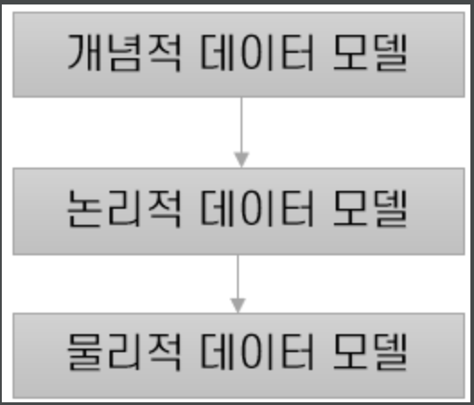
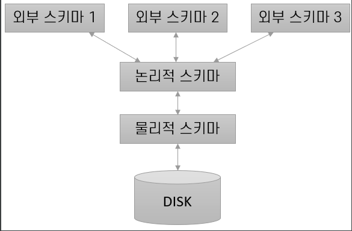

= DBMS

DBMS INDEX

. ** File System과 DBMS **

. ** DBMS에서 데이터의 명세 및 저장 **

. ** 데이터 모델 **

. ** 데이터 독립성 **

. ** 데이터베이스 질의 **

. ** 동시 접근 및 복구 **

. ** Transaction **

. ** DBMS의 Structure **

. ** OpenSource DBMS **

---

== File System and DBMS

---

** 10TB의 데이터를 불러오는 경우를 가정해보자.

*** 디스크에 10TB의 데이터를 메모리에 불러오는 것은 불가능 //

**** Solution => 필요한 부분만 메모리로 가져오도록 함

*** 32비트 주소를 저장하는 시스템 -> 4GB이상의 데이터 참조 불가능

*** 대부분의 운영체제의 보안 기법 : PassWord Signification

**** 각 데이터의 특정 부분별로 다른 보안 정책을 사용 할 수 없음

 Basic ex) A데이터와 B데이터에 접근하려고 하는 UserA
     UserA 는 A와 B에 접근하려면 같은 보안 방식으로 접근

 Solution ex) A데이터와 B데이터에 접근하려고하는 UserA
     UserA는 A데이터와 B데이터에 접근하기 위해선 다른 보안정책을 사용하기에
     접근을 위해선 A와 B 각각의 다른 보안기법을 통해 접근해야 함

*** 다른 프로그램을 사용하더라도 같은 정보를 가져올 수 있도록 작성해야 함

*** 서로 다른 사용자가 같은 데이터를 동시에 사용해도 데이터의 무결성을 해치지 않도록 방지해야 함

*** 데이터의 변경시간동안, 시스템이 고장이 나더라도 복구 가능해야 함.

*** DBMS는 방대한 데이터에 대ㅐ한 수천명의 동시 접속을 캡슐화를 이용해 처리함.

 장단점을 불리해놓지는 않았지만, 위에의 기존 File System에서 발생 할 수 있는 문제들을 해결하기 위해서 DBMS가 고안되어 사용되어지고 있습니다.
 또한 DBMS에서 처리하는 내용들은 개발자가 작성해야 할 프로그램에서 고려할 필요가 없어집니다.

== DBMS에서 데이터의 명세 및 저장

---

** DBMS는 저장된 데이터를 모델 형식으로 정의

*** 데이터 모델

**** 디스크 수준에서 데이터 저장 내역을 감추고 고 수준으로 데이터를 명세

 사용자는 데이터의 내부를 들여다 보지 않으므로 physical level에서는 설계시 저수준으로 설계

*** 현실 세계의 정보를 컴퓨터로 표현하기 위해, 단순화 및 추상화과정을 통해 체계적으로 표현하는 개념적 모형

*** DBMS의 데이터 저장 방식과 실세계의 간극을 좁히기 위해 개념 데이터 모델을 사용

*** 데이터 모델은 DB 구조의 근간을 이룸 -> DB 설계시 논리적인 구조 표현을 위함

**** 저수준 저장 내역(Pyhsical Level)은 감추고, 고수준 저장 내역(Conceptual Level)은 개방되어짐
**** 관계, 흐름에 필요한 처리 과정에 관한 추상화된 모형 -> 유지보수와 개발의 기준이 됨

== 데이터 모델

---

* 데이터 모델은 데이터, 정보를 표현하기 위한 표기법

. ** 데이터의 구조 **

** 컴퓨터에서 데이터를 구현하는데 사용되는 데이터 구조는 관점에 따라 다름

*** 데이터베이스 관점 => 데이터의 물리적 구조

*** 데이터 관점 => 데이터의 개념적 구조

. ** 데이터에 대한 작업 **

*** 데이터에 대해 수행(UPDATE, DELETE, ...)할 수 있는 작업을 제한

*** 수행을 제한하는것은 장점으로 연결됨

**** DB작업을 높은 수준에서 설명함과 동시에 DBMS가 작업을 효율적으로 할 수 있도록 구현 가능

*** 데이터에 대한 제한을 걸어두지 않으면 비효율적이게 됨

. ** 데이터에 대한 제약 조건 **

*** 어떤 데이터인지에 대한 제약 사항을 설명

* 주요 데이터 모델

. ** 관계 데이터 모델 **

*** 술어 논리와 집합론에 기반을 둔 DB 모델

**** 개체와 개체들 사이의 관계

*** 논리적 DB모델중 가장 널리 사용되는 모델

**** 하나의 개체에 대한 Relation 이라고 불리는 Table 형태의 집합으로 저장

*** 단순하고, 강력한 표현력을 가진것이 특징

*** 테이블, 배열과 유사 => Structed Data

. ** 반정형 데이터 모델 **

*** 다양한 형태로 표현 됨

**** 트리, 그래프와 유사 => SemiStructed Data

> 데이터를 표현하는 방식의 종류

---

. ** Structed Data **

*** 특정 데이터 모델로 데이터가 구성되어져 있는 경우 (Matrix 구조를 생각하면 쉬움.)

*** ex) 스키마를 가진 xml 파일

. ** UnStructed Data **

*** 특정 데이터 모델로 데이터가 구성되어져 있지 않은 경우

*** ex) 스키마를 가지지 않은 xml, txt

. ** SemiStructed Data **

*** 두 데이터 모델의 절반쯤

*** ex) csv, json파일

---

* 기타 데이터 모델

. ** 네트워크 데이터 모델 **

. ** 계층형 데이터 모델 **

. ** 객체 지향 데이터 모델 **

== 데이터 독립성

---

> DBMS의 장점 -> 데이터 독립성(Data Independency)

* 스키마

** 응용 프로그램은 데이터의 구성 및 저장 방식으로부터 격리 되어짐.

** 세 단계의 데이터 추상화를 통해 얻을 수 있음

***

* 스키마는 DB의 자료의 구조, 자료의 표현 방법, 관계와 제약조건을 형식 언어로 정의한 구조

* 스키마는 다음과 같은 특징을 기술 합니다.
. ** Entity : 개체**
. ** Attribute : 속성**
. ** Relation : 관계**
. ** Constraint : 제약조건**

***

* DBMS의 3단계의 추상화 표현

. ** 외부 스키마 **

** 사용자의 수준에서 데이터 접근을 개별화 하기 위한 권한 부여

** 스키마 별로 권한 설정을 달리하여, 업무에 형태에 맞는 데이터만 접근하도록 함

** 스키마를 나누어서 분리시킨 하나의 스키마를 View라고도 얘기함.

** View는 테이블과 같은 개념을 가지지만, 저장이나 수정은 불가능 함. 오직 불러오는 용도로 사용 됨

** 사용자의 요구사항에 따름.

** 저장 권한이 없기에, 중복 저장을 막고, 데이터 불일치성을 제거하는데 도움이 됨.

. **개념 스키마 (논리적 스키마)**

** 데이터의 논리적인 구조, 저장 방식/공간 변화로부터의 보호

** Relational DBMS 에서 table에 명세 정보가 들어져 있음

*** ex) 온라인 쇼핑몰

 상품 분류(분류번호: 정수, 분류이름: 문자열)
 상품(상품번호: 정수, 모델번호: 문자열, 상품이름: 문자열, 상품가격: 실수, 설명: 문자열)
 장바구니(장바구니번호: 정수, 수량: 정수, 날짜: 날짜)
 고객(고객번호: 정수, 고객이름: 문자열, 전자메일: 문자열, 암호: 문자열)
 구매(구매번호: 정수, 주문일자: 날짜, 배송일자: 날짜)
 주문상세(상품번호: 숫자, 수량: 숫자, 가격: 실수)

** DB 설계(Conceptial Database Desgin)단계에서 ER 모델을 이용해 설계

** 배포를 목적으로 하지 않고 단지 필드를 어떻게 구성을 하는지에 중점.

. ** 물리적 스키마 (내부 스키마)**

** 디스크 내부의 데이터가 어떻게 배치되어져있는지(감춰진 정보)

.. ** 파일 조직**
.. ** 검색을 위한 인덱스 **
.. ** 보조데이터 구조**
.. ** 상세 저장 내역**

** 개념 스키마가 어떤 데이터베이스 관리 시스템을 배포될 것 인지를 목적

** 개념 스키마는 자료를 B-Tree에 저장할지, Heap에 저장할지에 대한 고려를 하지 않음

** 만약, 저장할 데이터의 도메인이 정수라고 개념스키마에서 정의 했다면, 물리적 스키마에선 4byte, 8byte 등의 크기도 지정

** 아래의 예시에서 다음 테이블이 무슨 목적을 가지는지에 대한 의도는 모름. 저장의 구조에만 관심이 있음

** 물리적 데이터베이스는 sql에서 CREATE, ALTER, DROP 구문이 해당함

[source, sql]
----
CREATE TABLE [학생] (
[학번]		int,
[이름]		nvarchar(12)		NOT NULL,
[전자메일]	varchar(30)		    NULL,
[나이]		int			        NOT NULL,
[학점]		decimal(2,1)		NOT NULL
)
----

---

