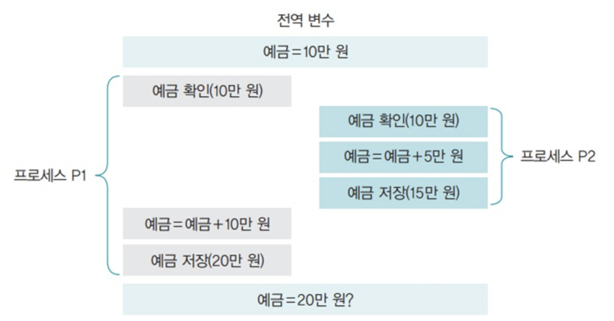
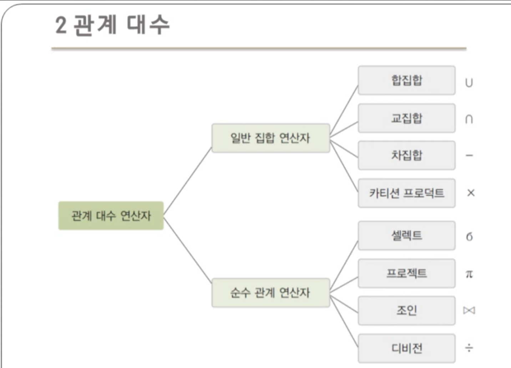

= 데이터베이스 질의

* 데이터베이스 쿼리 방식에 따라 데이터베이스 가치가 정해짐

* 데이터를 얻기 위한 질문의 전산학적 구현

* DBMS는 Query Language 제공

. ** DML **

** 정의된 DB에 데이터 조회, 수정, 삭제, 입력

** 사용자가 저장된 언어를 실질적으로 처리

. ** DDL **

** 데이터베이스를 정의하는 언어

** 저장되는 형식을 정의

. ** DCL **

** DB에 접근 제어

** 데이터에 대한 접근 권한 관리

---

. ** 관계 해석 (Relational Caiculus)**

** 수학적 논리에 기반을 둠 -> 직관적이고 정확한 의미를 지님

. ** 관계 대수 (Relational Algebra)**

** 릴레이션을 조작할 수 있는 연산자들의 합성

** DML의 일부

** DB는 데이터의 모양을 정의, 삽입, 삭제, 수정, 보안 제어

---

== 동시 접근 및 복구

---

* DB에 수많은 사용자가 동일한 데이터에 접근

** 각 요구사항에 상호 독립적인 수행

** 서로 같은 데이터에 접근하고 있다는 사실을 사용자 관점에서 몰라야 함

*** 사용자는 마치 본인이 격리되어진 프로그램을 격리되어 수행하고 있는것처럼 생각해야 함

** 레이스 컨디션 발생

** 두 프로그램이 서로 간섭하는 형태로, 교대로 수행되서는 안됨

* 시스템 장애 순간에도 일관성 유지

** 장애의 순간에 일어난 동작도 문제없이 일관성을 가져야 함

** 시스템 재 시동 이후, 일관성 있는 데이터 유지

== 트랜잭션 (transaction)

* 분해가 불가능한 프로그램의 실행 단위

* ACID

. Automaticity(원자성) -> 관련 작업이 전부 처리되거나 아에 되지 말아야 함
. Consistency(일관성) -> 트랜잭션 이전과 이후의 데이터베이스 상태는 이전과 같이 유효해야 함
. Isolation(격리성) -> 모든 트랜잭션은 다른 트랜잭션들로부터 독립되어 동작해야 함
. Durability(지속성) -> 트랜잭션이 성공적으로 수행되었다면 완료의 효과는 지속되어야 함

** 원자성과 지속성을 위해서 데이터베이스 로그(DB Log)와 로그 우선 기록(Write Log Ahead) 사용

** 격리성을 위해 잠금 규약(Locking Protocol)을 사용

** 일관성을 위해 제약 조건(Constraint)를 사용

 ex) 원자성
은행 업무에서 계좌이체 성공 or 실패하는 경우
(UserA는 실패, UserB는 성공 // UserA는 성공, UserB는 실패 )이런 경우는 존재하지 않음

 ex) 일관성
트랜잭션이 성공했을 경우, 일관성 있는 데이터베이스 유지// if, ID != null이라는 조건이 있을 경우, ID는 어떤 경우에서라도 null값이 들어와있으면 안됨

 ex) 격리성
트랜잭션이 수행될때, 다른 트랜잭션이 끼면 안됨 -> 성능과 관련되서 유연성이 있는 성질임

 ex) 지속성
트랜잭션이 성공했을 경우, 완료의 효과는 영구적이어야 함.

== 데이터베이스 관리 시스템의 구조

. ** Query **
. ** Query Optimizer and Excution **
* 쿼리 최적화기 실행
* 데이터의 구조와 통계를 이용하여 효율적인 수행 계획을 수립하고 실행
* 실행 계획은 대게 관계 연산자의 트리로 표현됨

. ** Relational Operation **
* 관계 연산자
* 데이터에 대한 질의를 생성 및 수행
. ** File and Access **
* 파일과 접근 방식
* 여러 형태의 파일내의 페이지를 추적 감시하여 한 페이지 내에 정보들을 조직하는 방법을 수행

** 사용할 수 있는 두 지역공간을 프레임이라고 하는 페이지로 나눔
** 트랜잭션의 요청에 따라 페이지를 디스크에서 메인메모리로 fetch
** 파일과 접근 방식, 데이터베이스 관리 시스템은 페이지나 레코드의 모임으로 간주
** 인덱스와 힙을 포함한 다양한 형태의 파일을 지원

. ** Buffer Manager **
* 버퍼 관리자
* 메모리 버퍼에 적재된 주 기억 장치의 공간의 데이터를 프레임 단위로 구분하여 처리
. ** Disk Manager **
* 디스크 관리자
* 데이터가 저장될 디스크의 공관을 관리
. ** Database **

