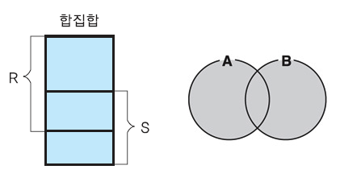
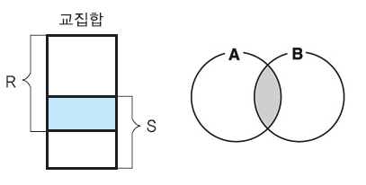
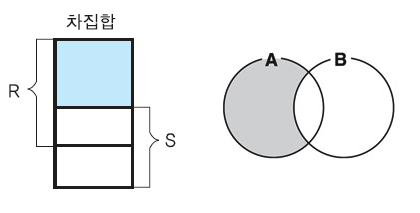

= 집합 연산(SET Operation)

==== UNION (합집합)

*  대수 관계식  ∪

* 두 SQL의 질의어의 합집합.

* 두 질의어의 결과가 합병 가능 조건인 경우만 가능

* SELECT와 다르게 중복 지움

** UNION ALL -> 중복 제거 취소

** SELECT DISTINCT -> 중복 제거

----
입력

SELECT KindOfAircraft, Airline
FROM Aircraft
UNION
SELECT KindOfAircraft, Airline
FROM Aircraft
----

----
출력

+----------------+---------------------+
| KindOfAircraft | Airline             |
+----------------+---------------------+
| Boeing 747     | 대한항공            |
| Boeing 727     | 대한항공            |
| Airbus A380    | 아시아나 항공       |
| Airbus A300    | 대한항공            |
| Boeing 737-800 | 제주항공            |
+----------------+---------------------+
----

----
입력

SELECT KindOfAircraft, Airline
FROM Aircraft
UNION ALL
SELECT KindOfAircraft, Airline
FROM Aircraft
----

----
출력

+----------------+---------------------+
| KindOfAircraft | Airline             |
+----------------+---------------------+
| Boeing 747     | 대한항공            |
| Boeing 727     | 대한항공            |
| Airbus A380    | 아시아나 항공       |
| Airbus A300    | 대한항공            |
| Boeing 737-800 | 제주항공            |
| Boeing 747     | 대한항공            |
| Boeing 727     | 대한항공            |
| Airbus A380    | 아시아나 항공       |
| Airbus A300    | 대한항공            |
| Boeing 737-800 | 제주항공            |
+----------------+---------------------+
----

=== INTERSECT(교집합)
* 관계 대수식 ∩

* 두 SQL질의의 결과가 합병 가능 조건이면 INTERSECT 연산 가능

* SELECT절과는 다르게, 중복을 제거

** INTERSECT ALL -> 중복 유지

* 인천에서 탑승한 승객 중 제주에서 내린 승객의 이름과 나이를 구하라”

----
입력

SELECT PassengerName, Age
FROM
Passenger INNER JOIN Reservation ON Passenger.PassengerNo = Reservation.PassengerNo
INNER JOIN Flight ON Reservation.FlightNo = Flight.FlightNo
INNER JOIN Aircraft ON Flight.AircraftNo = Aircraft.AircraftNo
WHERE
Flight.Depareture = '김포'
AND
Flight.Arrival = '제주'
----

==== EXCEPT(차집합)

* 관계 대수식 -

* 두 질의의 결과가 합병 가능 조건이면 연산 가능

* 중복 제거

** EXCEPT ALL 사용해서 중복 유지

