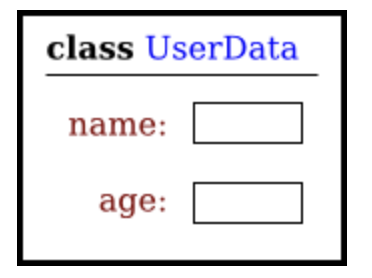
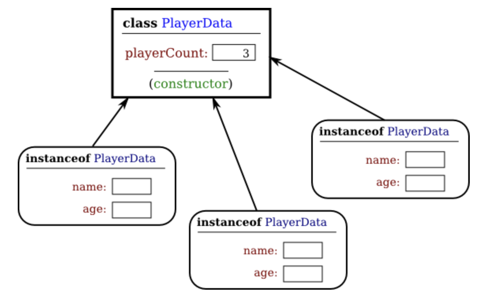
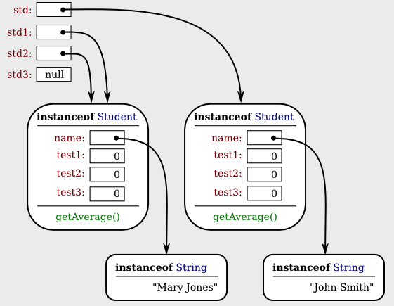

= Objects, Instance Methods, and Instance Variables

* OOP는 객체 (행위, 상태)가 상호 작용알 할 수 있는 개체이다.

* 클래스를 묘사라고 표현하는데, 묘사하는 실질적인 부분은 (non-static)비정적인 부분이다.

----
class UserData {
    static String name;
    static int age;
}
----

* static 으로 선언된 name, age는 클래스 자체의 변수

----
class PlayerData {
   static int playerCount;
   String name;
   int age;
}
----

* static 으로 선언된 playerCount는 클래스 자체의 변수
* name, age는 non-static으로 인스턴스가 가질 수 있는 변수(non-static을 dynamic이라고도 얘기함)

** 클래스 자체가 가질 수 있는 변수 : class variable

*** 같은 클래스의 instance들은 class variable를 공유함

** Object로 생성하는 변수 : instance variables

*** 'Object는 클래스에 속한다' 라고 표현함

** 메섣 또한 마찬가지로 변수와 비슷함.

TIP: Static 변수는 클래스 자체의 변수인것을 '명시'한다고 생각하고 Non Static변수는 인스턴스를 구분시킬 수 있는 '명시'라고 생각하면 조금은 수월해짐

---

> In Java, no variable can ever hold an object.
A variable can only hold a reference to an object.

"자바에서, 어떠한 변수도 객체를 가질 수는 없다. 변수는 오로지 객체에 대한 참조만을 보유할 수 있다."

* 객체는 Heap(힙) 공간에 저장된다("서식한다")

* 변수라는 것은 메모리 안에 있는 객체를 찾는데 필요한 정보를 가짐
** 그러한 정보들을 reference, pointer라고 말함
** reference나 pointer는 객체가 저장된 어딘가의 메모리위치의 주소이다.
-

----
std = new Student();
----

* 'std는 객체를 저장하는 공간이다'는 말이 이해에는 쉽지만, 사실은 'std는 Student 클래스 인스턴스를 가리키는 어떤 메모리 위치의 주소이다.'가 정답이다.

* 클래스 인스턴스는 객체를 참조할 수도 있지만, 참조를 아에 안하는 경우도 존재한다. 이런 경우를 "null pointer" or "null reference"를 보유한다고 말한다.

----
std = null;
----

NOTE: null은 주소를 가리키는게 아닌, 실제 값이다.

----
Student std, std1,       // Declare four variables of
          std2, std3;    //   type Student.

std = new Student();     // Create a new object belonging
                         //   to the class Student, and
                         //   store a reference to that
                         //   object in the variable std.

std1 = new Student();    // Create a second Student object
                         //   and store a reference to
                         //   it in the variable std1.

std2 = std1;             // Copy the reference value in std1
                         //   into the variable std2.

std3 = null;             // Store a null reference in the
                         //   variable std3.

std.name = "John Smith";  // Set values of some instance variables.
std1.name = "Mary Jones";

     // (Other instance variables have default
     //    initial values of zero.)
----

> When one object variable is assigned to another, only a reference is copied. The object referred to is not copied.

"하나의 객체 변수가 다른 것에 할당될 때, 오로지 참조만이 복사된다. 참조된 객체가 복사되는 것이 아니다. "

* 객체는 변수안에 존재하지 않고, 객체를 reference, pointer하는 값을 가지고 있다는것을 명심하자!

---
==== Equals, Compare

* 객체를 비교하기 위해선 '=='나 '!='를 사용하면 안된다.
** reference type인 객체는 주소값을 저장하고 있기에, 두개의 reference type를 가리키는 곳이 같은지를 판별하는 경우에는, 상관 없다
** 하지만, 값을 비교하고 싶은 경우가 있을것인데, 그럴때는, 다음과 같이 비교하면 된다.
----
td1.test1 == std2.test1
&& std1.test2 == std2.test2
&& std1.test3 == std2.test3
&& std1.name.equals(std2.name)"
----

---

* 클래스에서 멤버 변수를 만드는것에도 접근 제어자를 작성하는것에 주의를 기울여야 한다.

** 대부분의 멤버 변수는 private로 선언됨. -> 변수를 완벽하게 제어

** private이라도, 같은 클래스에서 getter method를 작성하면 값을 불러 올 수 있음.

*** 참고로, type이 만약, boolean일 경우, get보다는 is를 통해서 메서드를 선언

** getter method는 변수에 직접 '읽기 제어(read access)' 를 제공한다.

** setter mehtod는 마찬가지로, 변수에 '쓰기 제어(write access)' 를 제공한다.

** getter와 setter를 사용하는 이유는, 변수를 읽고쓰는것을 직접하는것이 올바르지 않기 때문이다.

----
public String getTitle() {
    titleAccessCount++;  // 멤버 변수 titleAccessCount를 증가시킴.
    return title;
}
----
다음과 같이, 조회수를 증가시키는 용도로 사용되게 get메서드를 작성할 수 있고,

----
public void setTitle( String newTitle ) {
   if ( newTitle == null )   // 널 문자열을 제목으로 허용해선 안 된다!
      title = "(Untitled)";  // 적절한 기본 값을 대신 사용.
   else
      title = newTitle;
}
----

다음과 같이, 변수에 set할 값이 올바른 값으로 들어가는지 판별하는 문장을 작성 할 수 있다.

---
==== array

* array 안에서 new로 생성하지 않은 null인 상태일 , variable.length를 사용한다면 오류(NullPointExecption) 발생

