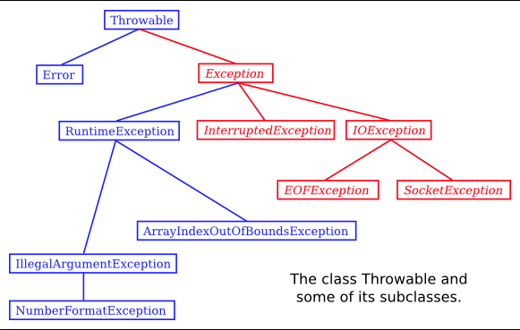

= ㄷException and try...catch

* 예외 클래스 (throw해야할 클래스)의 상속 관계

=== Exceptions and Exception Classes

* 예외가 발생할때, 프로그램이 종료되는 이유는, 메인 스레드를 실행 중에, 예외가 발생하면 예외 스레드를 생성해서 스레드간의 충돌이 발생하게 되어서 오류가 나는거였음.
멀티스레드를 사용하면, 여러 스레드들중에서, 예외가 발생한 스레드와의 충돌때문에, 다른 스레드들은 그대로 실행됨

=== Throwing Exception

* 서브루틴에, 스레드를 제어하는 방법은 일반적으로는 없지만, try catch문장을 이용해서 제어 할 수 있다.
* 하나의 쓰레드에서 충돌이 발생하게 되면, 전체 서브루틴 호출 체인을 통과하는 프로그램을 중단시킴

** 내 느낌상, 해당하는 쓰레드에서만 그 쓰레드의 콜 스택에 저장되어진 서브루틴들이 전부다 종료되니까, 다른 쓰레드에서는 프로그램이 계속 진행되는거같음.

link:/Users/younho/Documents/1009test/mordeninjava/thread/Thread클래스확장/MyExercise.java[위의 내용 실습 예제]

* 예외를 다루는것은, 예외마다의 이유가 다르기때문에 필수적이다.

* 서브루튼일 다루는 2가지 방법
. ** 서브루틴 내부에 예외가 발생하는 부분을 try, catch문으로 묶기 **
** 서브루틴 호출자는 예외를 볼 수 없음
. ** 서브루틴이 예외를 발생시킬 수도 있다고 선언하는 것// 제목에 throws절을 추가 **
** 서브루틴 호출자가 예외가 발생하는것을 볼 수 있음.
* Exception의 서브클래스가 아닌 클래스는 예외를 다루는것이 필수이다.
** 호출자가 입력이 잘못되어져있다는 사실을 알리기 위함.

==== Programming with Exception

* if문으로 하면, 다양한 경우를 처리해야 하지만, exception을 사용하면, 예외를 묶을 수 이따.
* exception을 사용자 정의하기 위해선 Exception클래스를 필수적으로 extends해야함.