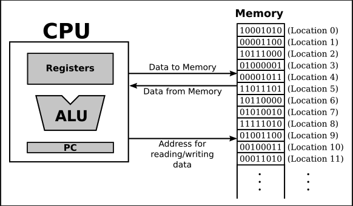

= The Fetch and Excute Cycle: Machine Language

* 컴퓨터의 구성 -> 다양한 요소들의 복합적인 시스템

** 중요한 부분은, 여러 장치가 있더라도, 중요한곳은 한곳! -> CPU(Central Processing Unit) // 프로그램을 실행시키는 부품

***

* 프로그램은 컴퓨터가 따라야 할 명확한 명령들의 목록

* 컴퓨터는 간단한 유형의 언어로 작성된 명령을 수행하도록 설계되었다.

* 각 타입의 컴퓨터는 자신만의 언어를 가지고 있고, 만약 프로그램이 해당 언어로 표현되어진다면, 바로 수행한다.

* CPU가 프로그램을 실행시킬 때, 메인 메모리에( RAM == Random Access Memory ) 저장한다.

* 프로그램 외에도 메모리에는 프로그램에서 사용하거나 처리하는 데이터를 저장한다.

* 메인 메모리는 연속적인 위치를 가진다

* 이런 위치는 숫자로 구성되어져 있고, 연속된 숫자의 위치는 주소라고 불림

* 방대한 양의 메모리 사이에서 하나의 주소는 하나의 특정 조각의 정보를 제공한다

* CPU가 프로그램의 명령이나 데이터의 특정 위치를 필요로 할때, 하나의 단일 메모리에서의 정보를 담은 주소를 보낸다.

* 메모리는 지정된 위치에 포함된 값을 보낸다.

* CPU는 또한 메모리 안에 저장된 정보 그리고 저장된 주소의 위치가를 특정함으로써 정보를 저장한다 .

* 기계어 수준에서는, CPU의 연산은 매우 간단하다(비록 세부적으로는 매우 복잡할지라도).

* CPU는 메인메모리 안에 연속적으인 기계어의 명령어를 저장한 프로그램을 실행한다.

* 반복적인 이 과정 — 명령어 추출 및 실행, 다른 명령어 추출 및 실행, 등등 — 을 추출 및 실행 주기(fetch-and-execute cycle)라 한다

* CPU Core가 많아질 수록, 여러 명령어들을 동시에 처리 할 수 있다.

* 캐시 메모리를 통해서 메인메모리에 대한 접근이 더 빨라진다.

* 캐시 메모리는 메인 메모리보다 더 빠르게 접근하고, 곧 필요할 명령어와 데이터를 보관한다.

* 그러나, 이것은 기본 연산을 바꾸지는 않는다.

---

* CPU는 덧셈과 뺄셈작업을 수행하는 산술연산장치, ALU(Arithmetic Logic Unit)를 가지고 있다.

* ALU는 적은 갯수의 Register를 가지고 있는데, 이러한 것들은 하나의 숫자를 보유할 수 있는 작은 메모리 Unit이다.

* 전형적으로 CPU는 16 or 32개의 일반 목적용(general purpose) 레지스터를 가지고 있다.

* 이러한 작은 레지스터는 즉각적으로 처리 가능한 데이터 값을 포함한다.

* 많은 기계 언어 명령어들이 위의 레지스터를 참조한다.

** ex_1) 특정 두개의 레지스테로부터 두개의 숫자를 취하는 명령어

*** ALU를 통해서 두개의 숫자를 더하거나, 저장하고 다시 하나의 레지스터에 저장한다.

** ex_2) 데이터의 값을 메인 메모리로리로부터 레지스터로 카피하는 명령어

** ex_3) 레지스터로부터 메인메모리로 값을 저장하는 명령어

* CPU에는 특정 목적용(special purpose) 레지스터도 있다.

* Program Counter(PC) 는 실행중인 프로그램의 위치를 추적하는 목적을 가지고 있다.

* PC는 다음 실행할 메모리의 주소만 저장한다.

* 각각의 fetch-excute cycle이 시작될때, CPU는 PC에서 어떤 명령어를 추출해야하는지 검사

* 추출과 실행 주기 과정 도중, PC의 번호가 업데이트되어 다음 다음 실행할 주소를 표시함

* 항상 PC가 이런식으로 연산을 진행하지는 않지만, 대체로 이런식으로 흘러감

* 일부 기계어 명령에선 PC에 저장된 값을 수정하는 경우도 간혹 있음 -> jump

** jump는 루프에서 발생

---

* 컴퓨터는 기계어를 기계적으로 실행한다. (그리고 기계어를 이해 할 수 없음 // 또한 어려운 개념이기도 함) 물리적으로 결합되는 방식이기때문에, 위와 같은 특징을 지님

* 컴퓨터는 transister라고 불리는 수백만개의 작은 스위치로 구성되어져 있기때문에, 하나의 스위치에서 나오는 출력이 다른 스위치에 영향을 끼침

* 컴퓨터가 연산을 할때, 스위치의 연결 방식과 프로그램에 의해 on, off가 결정된다.

* 기계어는 이진 숫자로 표현된다.

* 이진 숫자는 두개의 숫자로 구성되어져 있고, 0과 1이 그 숫자이다. 그리고 각각의 숫자를 bit라고 읽는다.

* 그래서, 기계어는 0과 1의 일련에 불과하다.

* 각 부분들의 연속은 특정 명령어를 인코딩(해독) 한다.

* 컴퓨터가 조작하는 데이터도 이진수로 표현된다.

* 현대 컴퓨터는, 각 메모리의 위치가 바이트(1byte = 8bit)단위로 구성되어져 있다.

 0 = 1bit
 10011001 1byte(8bit)

* 기계어 명령이나 데이터 조각은 일반적으로 여러 연속되는 메모리 위치에 저장되는 바이트들의 단위들로 구성되어져있다.

** ex_1) CPU가 메모리로부터 명령어를 읽을때, 아마도 4~8개의 메모리 위치에서 4~8바이트를 읽는다.

 10011101 -- 위치(Location) 0
 00110101 -- 위치(Location) 1
 11001010 -- 위치(Location) 2
 11010100 -- 위치(Location) 3
 8bit의 크기만큼 4개의 위치를 읽은 하나의 데이터.
 저수준의 물리적인 언어이기에 해독이 어려움

* 명령어의 메모리 주소는 해당 바이트들의 첫번째 주소.

** 위의 데이터가 "김윤호"를 나타내는 데이터라면, "김윤호" 라는 데이터는 주소 0에 저장되어서 0~3까지의 메모리를 차지하는 데이터인 것이다.

* 컴퓨터는 직접 이진 숫자를 작동 시킬 수 있고, 스위치는 그런 이진 숫자들을 표현 할 수 있다.

** 스위치 on -> 1

** 스위치 off -> 0

* 기계어는 스위치를 끄고 키는 패턴으로서 저장된다.

* 기계어가 CPU에 적재되면, 모든 상황은 특정 스위치가 패턴 안에서 명령어를 인코드 하는 on, off 하는것이 전부이다.

* CPU는 인코딩하는 명령을 실행하므로써 패턴에 만응하도록 만들어진다.

* CPU의 모든 스위치가 함께 연결되어져 있기 때문이다.

---

* 아래 그림을 이해해보자.

* 메인 메모리

** 기계어 프로그램,  데이터

** 기계어(binary number)로 이루어짐

* CPU

** 메모리로부터 연산을 실행하기 위해 기계어 명령을 추출한다.

** 각 명령들은 CPU가 작은 업무를 수행하게 만듬

** 위의 예시처럼, 두개의 수를 더하거나, 메모리로부터 데이터를 움직이는 일

** CPU는 이런 기계적인 모든 일을 스스로 이해하거나 생각하지 않고, 수행 할 프로그램은 완벽해야하고, 안전해야하며 모호하지 않아야 한다.

---

