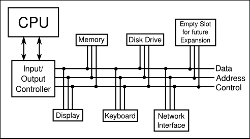

= Asynchronous Events: Polling Loops and Interrupts

* CPU의 역할은 메모리에서 명령어를 실행한다

* 컴퓨터는 여러가지 장치가 포함되어져 있다.

. ** HardDisk(HDD), Solid State Drive(SSD) **

** 많은 데이터 정보를 저장하고 있다.

** 하드디스크 내부의 프로그램이 실행될 때, 메인메모리로 적재 되어야 실행 가능

. ** Keyboard, Mouse **

. ** Monitor, Printer **

. ** Audio Output Device **

. ** Network Interface **

. ** Scanner **

---

> 메인메모리 vs 하드디스크

. ** 데이터의 양:    메인메모리 < 하드디스크**

. ** 영구성:  메인메모리 -> 비영구적 ||  하드디스크->영구적**

. ** 처리 속도:  메인메모리 > 하드디스크 **

---

* CPU는 다른 장치들을 제어하고, 소통한다.

* CPU는 기계어 명령들을 통해서 실생 시킬 수 있다.

* 각 장치에 해당하는 device driver를 통해서 실행 시킴

** Device Driver는 CPU가 장치를 다루어 사용할 때, 실행되도록 구성된 소프트웨어이다.

* 새로운 장ㅇ치를 시스템에 설치한다면 두가지 방법이 있다..

. ** 물리적으로 컴퓨터에 연결 후 소프트웨어 설치**

. ** 장치 드라이버 없이, CPU와 장치드라이버가 통신 할 수 없기에, 실제 물리적 장치는 무용지물이 된다.**

---

* 많은 장치들로 구성된 컴퓨터 시스템은 하나 이상의 busses로 연결하므로써 조직되어져 있다.

* 하나의 버스는 다양한 종류의 정보들을 장치들간에 옮기는 wire들의 집합이다.

* wire는 데이터, 주소, 제어신호를 전달한다.

* 주소는 데이터를 특정 기기에, 그리고 아마도 디바이스 내부의 특정 위치나 특정 레지스터를 가리킨다.

* 예를 들어 제어 신호는 데이터 버스에서 데이터를 사용할 수 있음을 다른 장치에 알리기 위해 한 장치에 의해 사용될 수 있다

---

* 키보드 마우스, 네트워크 인터페이스같은 장비들은 CPU에 의해 처리되어질 필요가 있을때, 입력을 만들어낸다.

* 그러나, CPU는 데이터가 존재하는지 어떻게 알까?

** -> CPU가 계속해서 들어오는 데이터를 확인하는 방법
** -> 데이터를 찾았으면, 처리한다

** -> CPU는 한나의 데이터를 찾고 하나의 데이터를 처리하는 과정을 유지한다.

*** => 이러한 방법을 'Polling' 이라고 한다.

** CPU가 입력 장치를 지속적으로 조사하여 보고할 데이터가 있는지 여부를 확인하는 방법

* 불행히도, 비록 polling은 매우 단순하지만, 비효율적이기도 하다

* CPU는 입력을 기다리는 시간을 낭비한다.

* 이런 비효율적인것을 피하기 위해, Interrupt가 일반적으로 사용된다.

. ** Interrupt는 다른 장치에 의해 CPU로 신호를 보낸다. **
. ** CPU는 현재 하는 일이 무엇이든 제쳐두고, Interrupt 신호를 응답한다. **

** => 일단 Interrupt를 처리하면, interuppt에서 발생한 일을 먼저 처리한다.

* 인터럽트는 상상할 수 없을정도로 자주 일어나는 과정임!

 ex) Keyboard입력 신호가 다른 작업 중에 들어오면, interrupt 신호로 keyboard 입력 처리를 우선 진행 후 기존 작업으로 돌아간다.

* 다시 얘기해서, polling이나 interrupt과 같은 과정은 전부다 기계적인 과정인것을 인지해야 한다.

* CPU는 그 연결이 켜져 있을 때 CPU가 현재 하고 있는 일에 대한 정보를 충분히 저장하여 나중에 같은 상태로 돌아갈 수 있도록 만들어진다.

* 이러한 정보들은 프로그램 카운터와 같이 중요한 내부 레지스터 내용으로 구성되어져 있다.

* CPU는 미리 정해진 메모리 위치로 점프하고, 그곳에 저장된 명령어들을 실행하기 시작한다.

* 그러한 명령어들은 인터럽트에 응답하는 데 필요한 처리를 수행하는 인터럽트 핸들러(interrupt handler)를 구성한다

* 인터럽트 핸들러 끝에, CPU가 미룬 일을 재개하라는 명령이 있다.

* interrupt는 cpu가 asynchronous event(비동기 이벤트)를 다룰 수 있게한다.

* 일반적인 실행주기에서, 미리 정해진 순서대로 모든 일이 발생하고, 모든 일은 다른 모든것과 동기화 된다.

* 인터럽트는 CPU가 "비동기적", 즉 예측할 수 없는 시간에 발생하는 이벤트를 효율적으로 처리할 수 있게 해준다.

* 디스크에서는 지속적으로 인터럽트 사용되는 예시

* 디스크는 상당히 느리기에, CPU에서 메인 메모리에 적재할 디스크의 내용을 지속적으로 업데이트 함

* CPU가 해야할 일이 끝났다면, CPU는 계속해서 polling상태

* 멀티태스킹 (Multitasking)

** 하나의 컴퓨터가 여러가지 일을 동시에 하는 것.

** CPU의 속도는 상당히 빠르기에, 여러 사람이 하나의 컴퓨터를 사용 할 수 있고, 각 사용자에게 1초 분량을 할애할 수 있다.
** -> 멀티태스킹의 응용인 timesharing(시분할)이라고 한다.

* 각 개인적인 업무를 thread(쓰레드) 또는 process(프로세스)라고도 부른다

** 세부적인 뜻은 조금은 다름

* 많은 CPU들은 동시에 하나 이상의 스레드들을 동시에 실행할 수 있다.

* 그런 CPU들은 스레드를 작동시킬수 있는 여러개의 코어가 포함되어 있다.

* 그러나, 스레드들을 다룰 수 있는 숫자에는 한계가 있다.

* 더 많은 스레드들이 종종 동시에 실행 될 수 있지만, 컴퓨터는 한 사용자에서 다른 사용자로 변환 할 수 있어야 하듯이, 시분할하는 컴퓨터는 다른 사용장에게도 주의를 전환 할 수 있어야 함.

* 일반적으로 실행되고있는 스레드는 지속적으로 다음과 같은 여러 상황에서 발생하기 전까지는 계속 실행된다.

. ** Yield (양보) : 스레드가 자발적으로 제어권을 yield(양보)한 경우 (또한 양보해야하 하는 의무도 있음)**

. ** Blocked(블록) : 스레드는 일부 비동기 이벤트가 발생할 때까지 기다려야 할 수 있다. 예를 들어, 스레드는 디스크 드라이브에서 일부 데이터를 요청하거나 사용자가 키를 누를 때까지 기다릴 수 있다. 기다리는 동안 쓰레드는 블록되었다(be blocked)고 하며, 다른 쓰레드들이 만약 있다면 이들에게 실행될 기회가 있다. 이벤트가 발생하면 인터럽트는 쓰레드가 계속 실행될 수 있도록 쓰레드를 "웨이크 업(wake up)"한다. **

. ** Preemptive Multitasking(선제적 멀티태스킹): 쓰레드는 할당된 시간의 일부를 소모하고 다른 쓰레드가 실행될 수 있도록 일시 중단될 수 있다. 대부분의 컴퓨터는 이런 식으로 쓰레드를 "강제적으로" 중단시킬 수 있다; 그렇게 할 수 있는 컴퓨터들은 선제적 멀티태스킹(preemptive multitasking)을 사용한다고 한다. 선제적 멀티태스킹을 하려면 컴퓨터가 초당 100회 등 일정한 간격으로 인터럽트를 발생시키는 특수 타이머 장치가 필요하다. 타이머 인터럽트가 발생하면 CPU는 현재 실행 중인 쓰레드가 좋든 싫든 간에 한 쓰레드에서 다른 쓰레드로 전환할 기회를 가진다. 모든 현대적인 데스크탑과 노트북 컴퓨터, 그리고 심지어 일반적인 스마트폰과 태블릿도 선제적인 멀티태스킹을 사용한다. **

* 일반적으로 인터럽트와 인터럽트 핸들러를 다룰 필요는 없음. -> 컴퓨터가 다 알아서 해줬기 때문

* 요즘에는, 멀티태스킹과 멀티프로세싱을 사용하기에 중요해지고 있음.

* 자바는 내장된 스레드에 대한 지원이 훌륭함.

* 프로그래머들이 직접 인터럽트를 다루진 않지만, event handler를 쓰는것을 발견하는데, 인터럽트 핸들러와 비슷함 -> 특정 이벤트에서 비동기적으로 호출됨
