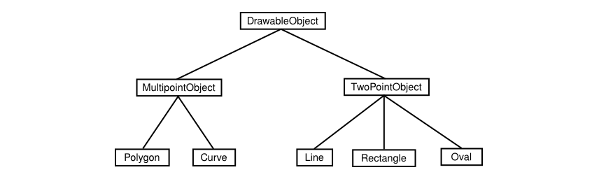

= Objects and Object-oriented Programming

* 소프트웨어 엔지니어는 어떤 문제를 분석하고, 해결하기 위해선 디자인할, 증명된 방법을 사용해야한다.

* 1970~1980년도, 가장 주목받는 엔지니어링 방법은 구조적 프로그래밍(Structured Programming)이다.

* 구조적 프로그래밍은 다음과 같은 장치들에 입거해서 증명되었다.

. ** 큰 문제를 해결하기 위해선, 문제를 여러 작은 조각으로 쪼개고 조각마다 따로 작업하는 방법 **

. ** 이러한 작은 조각들을 풀어내기 위해서, 더 작은 문제들로 하향식 설계(top-down programming) 기법을 사용해야 한다.**

* top-down programming은 아무 문제가 없었다.

* 문제 해결에 있어서 자주 사용되는 기법이긴 하지만, 이것은 불안전하다.

* 우선, 문제를 해결하려는데 필요한 명령어를 생산하는 일을 전적으로 다룬다.

* 그러나, 시간이 흐를수록, 사람들은 프로그램을 위한 data structures의 설계가 서브루틴과 제어 구조만큼 중요하다는것을 깨달았다.

* 하향식 프로그래밍은 조작하는 데이터를 충분히 고려하지 않았다.

* 또 다른 문제는, 하향식 프로그래밍기법이 다른 프로젝트에서 재사용을 어렵게 만들어서 제한적이라는것이다.

* 특정한 문제를 시작하는것에 있어서 작은 편리한 조각으로 세분화하므로써 하향식 프로그래밍은 설계를 독특한 문제를 만드는 경향이 있다.

* 적어도 광범위한 수정 없이는 다른 프로그램에서 상당한 양의 프로그래밍을 가져와 당신의 프로젝트에 적용할 수 없을 것이다

* 높은 양질의 프로그램을 생산하는것은 어렵고, 비싸다, 그래서 프로그래머들과 사람들은 과거의 작업을 재사용하기를 열망한다.

---

* top-down programming 과 bottom-top programming의 결합되는 경우가 많다.

* 상향식 설계에서 접근방식은 바닥에서 시작해서 이미 해결할 방법을 알고있는것부터 시작하는 방법

* 재사용가능한 요소는 "모듈형(Modular)"이어야한다.

* Module은 큰 시스템의 간단하고, 잘 정의되고, 직관적인 시스템의 나머지 부분과 상호작용하는 요소이다

* 이러한 아이디어는 시스템과 연결할 수 있다는 것이다.

* 모듈 내부에서 무슨일이 일어나는지에 관한 디테일들은 시스템 전체에서는 전혀 중요하지 않다, 할당된 역할을 올바르게 수행하는 한

* 이런 특징을 정보은닉(information hiding)이라고 하고, 소프트웨어 엔지니어링의 중요 원칙중 하나이다.

---

* 소프트웨어 모듈에서 하나의 흔한 형태는 데이터를 조작하기 위한 서브루틴과 함께 일부 데이터를 포함하는것이다.

* 예를 들어, 메일링 리스트(mailing-list) 모듈에는 새로운 이름을 추가하기 위한 서브루틴, 메일링 레이블(label) 인쇄를 위한 서브루틴 등과 함께 이름과 주소 목록이 포함될 수 있다

* 이런 모듈에서 데이터 자체는 종종 모듈 내부에 꼭꼭 숨긴다.

* 모듈을 사용하는 프로그램은 모듈이 제공하는 서브루틴을 호출하여 간접적으로만 데이터를 조작한다.

* 이것은 데이터를 보호하고, 그렇기에 우리가 알고있는대로 데이터를 조작하고 잘 정의하는 방법이다.

---

* 정보 은닉을 지원할 수 있는 모듈은 1980년도에 흔한 프로그래밍 언어다.

* 그 이후로, 동일한 개념을 보다 발전시킨 형태가 소프트웨어 엔지니어링을 거의 장악하게 되었다.

* 이러한 방식을 OOP(Object-oriented Programming)이라고 한다

* 가장 중요한 OOP의 개념중 하나는 데이터와 서브루틴을 포함하는 모듈의 한 종류인 객체(object)이다.

* OOP의 관점에서는 object가 내부 상태를 가지고 있고, 메세지에 응답할 수 있는 자족적 실체(self-sufficient entity)라는 것이다.

* 위의 메일링 리스트 객체를 예로들어봤을때, 주소목록과 이름의 리시트로 구성되어진 상태를 가진다는것이다.

** 만약에 이름을 추가하라는 메세지를 보냈을때, 변화를 반영하여 변경 상태를 수정하는 식으로 응답할것이다.

** 만약에 스스로 출력하라는 메세지를 보낸다면, 이름과 주소를 출력하는 방식으로 응답할 것이다.

---

* 소프트웨어 엔지니어링에 대한 OOP접근 방식은 문제와 관련해서 객체가 응답해야하는 메세지를 식별하는 것

* 고유의 데이터와 고유의 임무(Responsibilities) 집합이 있는 개체들의 모임이 된다.

* 객체끼리는 메세지를 보내면서 상호작용 한다.

* OOP를 사용하는 사람들이 세상 작동 방식에 더 적합한 모델이 되고, 따라쓰기 쉽고, 이해하기 쉽고, 정확할 가능성이 높다.

---

* 객체가 어떻게 특정 메세지에 응답하는지 "알고 있다"라고 생각해야 한다.

* 다른 객채는 아마도 같은 메세지를 다양한 응답을 할 것이다.

* print하는 명령에 따라 객체마다 다른 응답을 할 것이다. -> 같은 메세지로 다른 응답을 하는것을 (다형성)Polymorphism 이라고 한다.

* 객체들이 서로 일종의 '가족적 유사성'을 갖는 것은 흔한 일이다

* 동일한 유형의 데이터를 포함하고 동일한 방식으로 동일한 메시지에 응답하는 객체들은 동일한 클래스(class)에 속한다

* 실제 프로그래밍에서는 클래스가 우선이고, 같은 클래스가 아니더라도 비슷 할 수도 있다.

> 예를 들어 사용자가 화면에 선(line), 사각형(rectangle), 타원(oval), 다각형(polygon) 및 곡선(curve)을 그릴 수 있게 하는 그림 프로그램을 생각해보라. 프로그램에서 화면에 보이는 각각의 객체는 프로그램의 소프트웨어 객체로 표현될 수 있다. 프로그램에는 그릴 수 있는 가시적인 객체의 각 유형마다 하나씩, 다섯 가지 객체들의 클래스가 있을 것이다. 모든 선은 한 클래스에 속하고, 모든 사각형은 다른 클래스에 속하며, 그런 식이다. 이 클래스들은 분명히 관련성이 있다; 그들 모두는 "그릴 수 있는 객체들"을 나타낸다. 예를 들어, 그들은 모두 아마도 "자신을 그린다"는 메시지에 응답할 수 있을 것이다. 각 개체 유형을 나타내는 데 필요한 데이터에 기초한 다른 수준의 그룹화는 덜 명확하지만, 이는 프로그램에서 매우 유용할 것이다: 다각형과 곡선을 "다점(multipoint) 객체"로 함께 분류할 수 있는 반면, 선, 사각형, 타원은 "쌍점(two-point) 객체"로 분류할 수 있다. (선은 그것의 두 끝점에 의해 결정되고, 그것의 모서리에 의해 사각형이 결정되며, 그것을 포함하는 사각형의 두 모서리에 의해 타원이 결정된다. 내가 여기서 말하는 사각형은 수직과 수평의 면을 가지고 있어 단 두 점으로 특정할 수 있다; 이것은 그림 프로그램에서 "사각형"의 공통적인 의미이다.) 이러한 관계를 다음과 같이 도식화할 수 있다:

* 다음 그림에서는 클래스간의 상속관계에 대한 정리이다.

* 상속은 소프트웨어의 구성요소의 재사용 문제와도 관련이 있다.

** 재사용성을 증대시키기 위해선, 이러한 구조를 잘 설계해야 한다

** 필요에 정확하게 대응하는 작은 변경만으로 재사용하기 수월하다.

