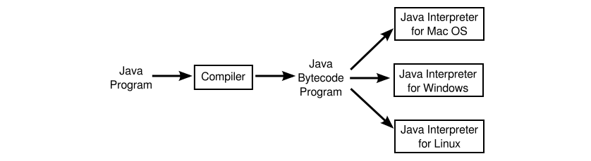

= The Java Virtual Machine

* 프로그램들은 대체적으로 high-level-language를 작성한다.(Java, Python, C++, ...)

* high-level 언어들은 직접적으로 컴퓨터가 실행 할 수 없기에, 먼저 기계어로 번역되어야한다.

* 이런 번역들은 컴파일러라고 불리는 프로그램에 의해 실행 된다.

* 컴파일러는  high-level -> excutable machine-language로 변환시켜준다.

* 컴파일이 끝나면 프로그램은 언제든지 실행 가능하다.

* 하지만, 각 컴퓨터마다 개인적으로 가진 기계어가 다르기때문에, 다른 컴퓨터에서는 실행이 불가능하다.

* 만약 프로그램을 다른 컴퓨터에서 실행하고싶다면, 다시 재 컴파일을 해야한다, 해당 컴퓨터 기기에 적절한 또다른 컴파일러를 통해서

---

* 고급언어는 컴파일만 존재하는것이 아니라, 컴파일러를 대신해 번역할 수 있는 interpreter도 있다.

* interpreter는 필요에 따라 명령어별로 프로그램을 한꺼번에 번역해준다.

* 인터프리터는 CPU와 비슷해서 실행주기를 가진다.

* 프로그램을 실행하기 위해서, 인터프리터는 프로그램에서 반복적으로 하나의 명령어를 읽는 루프를 실행한다.

* 명령어마다 필요한것을 끌어다 스면서, 그리고 적절한 기계어 명령을 수행한다.

---
컴파일러(compiler) => 번역된 책

전체 파일을 스캔하여 한꺼번에 번역한다.
초기 스캔시간이 오래 걸리지만, 한번 실행 파일이 만들어지고 나면 빠르다.
기계어 번역과정에서 더 많은 메모리를 사용한다.
전체 코드를 스캔하는 과정에서 모든 오류를 한꺼번에 출력해주기 때문에 실행 전에 오류를 알 수 있다.
대표적인 언어로 C, C++, JAVA 등이 있다.

인터프리터(interpreter) => 통역사

프로그램 실행시 한 번에 한 문장씩 번역한다.
한번에 한문장씩 번역후 실행 시키기 때문에 실행 시간이 느리다.
컴파일러와 같은 오브젝트 코드 생성과정이 없기 때문에 메모리 효율이 좋다.
프로그램을 실행시키고 나서 오류를 발견하면 바로 실행을 중지 시킨다. 실행 후에 오류를 알 수 있다.
대표적인 언어로 Python, Ruby, Javascript 등이 있다.

---

* 인터프리터의 용도중 하나는 고급 언어를 실행시키는 것

* 인터프리터의 또 다른 목적중 하나는 다른 종류의 컴퓨터에서 한 종류의 컴퓨터를 위한 기계 언어 프로그램을 사용 할 수 있도록 해줄 수 있다.

 Commodore) 64 또는 "C64"를 보자. 실제 C64를 찾을 수는 없지만 다른 컴퓨터에서 — 심지어는 웹 브라우저에서 — 실행되는, 이를 "에뮬레이트(emulate)" 하는 프로그램을 찾을 수 있다. 그러한 에뮬레이터는 C64 기계 언어의 인터프리터 역할을 함으로써 C64 프로그램을 실행할 수 있다.

---

* 자바 설계자들은 컴파일과 인터프리터를 조합하기로 선택.

* 자바로 쓰여진 프로그램들은 기계어로 컴파일 되지만, 기계어는 컴퓨터이 실질적으로 존재하지 않는다.

* 이것을 잘 알려진 "Java Virtual Machine(JVM)" 이라고 한다.

* JVM에서 이러한 기계어는 자바 바이트코드라고 한다.

* 왜 자바 바이트코드가 실제 컴퓨터의 기계어로 사용되지 않는지는 큰 이유는 없다.

* 그러나, 사실 가상머신의 사용은 어떤 컴퓨터에서도 사용 할 수 있다는 사실이다.

** 아까 얘기한대로, 컴퓨터마다 기계어가 다르기에, 하나의 작성된 프로그램은 다른 프로그램에서 돌릭 위해선
컴파일을 추가로 해야하지만, 가상머신을 통해 이런 단점을 보완하게 되었다.

* 자바로 작성된 프로그램을 실행시키기 위해서는 바이트 코드를 위한 이터프리터만 있으면 된다.

* JVM이 인터프리터와 같은 역할을 한다고 생각하면 된다.

* 물론 다른 자바 바이트코드 인터프리터는 각 컴퓨터에 필요하다. 하지만, 하나의 컴퓨터가 바이트코드 인터프리터를 가지고 있으면, 다른 어떤 자바 바이트프로그램이든 실행 가능하고, 똑같은 프로그램은 다른 컴퓨터가 가진 인터프리터에서 똑같이 실행 가능하다.

* 위에 설명한 JVM이 자바의 필수 기능중 하나이다.

* 자바프로그램 자체를 배포하고 각각의 모든 컴퓨터들의 언어로 표현하지 않는 이유

. ** 컴파일러는 복잡한 고수준 언어를 이해해야 한다. **

** 자바 바이트코드 인터프리터는 작고 간단한 프로그램이고, 컴파일러는 매우 복잡한 프로그램이다.

** 이렇게 되면, JVM(java bytecode interpreter)이 새로운 타입의 컴퓨터에 더 쉽게 쓸 수 있다.

. ** 일부 자바 프로그램은 네트워크를 통해서 다운로드되어진다. **

** 보안과 연결되는 문제를 야기시킨다.

** 바이트코드 인터프리터는 다운로드 하는 프로그램과 컴퓨터 사이에 Buffer 역할을 한다.

*** 실제 다운로드한 프로그램을 실행시키면, 간접적으로 인터프리터를 실행시키는 것과 마찬가지이다.

---

* 초기 자바는 인터프리터에 의해 실행됬기때문에, 느리다는 비판을 받았다.

* 자바 바이트코드 인터프리터로 프로그램은 native machine language로 컴파일 된 프로그램만큼 빨리 실행 할 수 없을것 같기때문이다.

* 추후 Just In Time 컴파일러가 개발되고 나서, 극복되었다.

* Just In Time 컴파일러는 자바 바이트 코드를 native machine language로 바꾸는 역할을 한다.

---

* 자바와 자바 바이트코드 사이에는 필수적인 연결점이 없다.

* 자바에 의해 쓰여진 프로그램은 실제 컴퓨터에서 기계어로 컴파일 된다.

* 다른 언어로 쓰여진 언어는 자바 바이트코드로 컴파일 될 수 있다.

* 그러나 자바와 자바 바이트코드의 조합은 플랫폼 독립성, 보안, 네트워크 호환성이 있는 동시에, 현대적인 고급 객체지향 언어로 프로그래밍 할 수 있도록 한다.

* JVM 으로 만들어진 새로운 언어들 : Scala(스칼라), Groovy(그루비), Clojure(클로저), Processing(프로세싱) 등이 있다.

