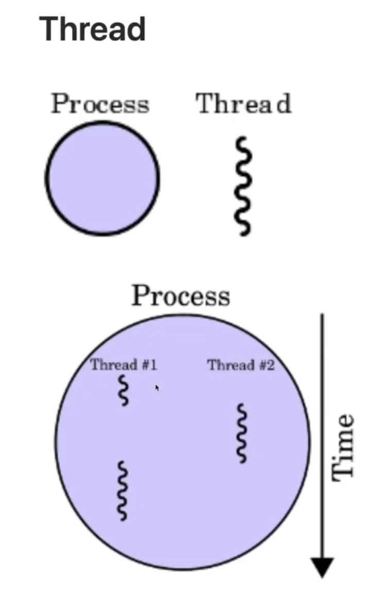

프로세스 특징 :

프로세스간의 통신 -> IPC

프로세스의 컨텍스트 스위칭은 IPC를 통해 일어나는데, 오버헤드가 발생해서 해결하는 방법으로 thread 사용

스레드란, 하나의 프로세스 안에서 여러개의 실행 흐름

스레드 특징

. ** 스레드는 프로세스 안에 존재 **
. ** 스레드는 프로세스의 head, static, code영역등을 공유**
. ** 스레드는 stack영역을 제외한 메모리 영역은 공유**
. ** 스레드가 code 영역을 공유하기 때문에, 프로세스 내부의 스레드들은 프로세스가 가진 함수를 호출 할 수 있음 **
. ** IPC 없이도 스레드간의 통신이 가능( Heap 메모리 영역에 메모리 공한 할당하고, 두 스레드가 자유롭게 접근 **)
 ** 스레드는 프로세스의 공유하는 메모리 덕분에, 컨텍스트 스위칭때문에 발생하는 오버헤드는 작다

> 컨텍스트 스위칭(context swicihing) : 병행처리중인 작업에서, 이전에 진행한 작업의 위치를 찾아가는 행위

스레드

