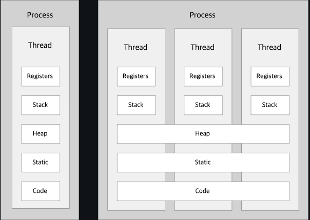

= Process VS Thread

* Process

. ** 실행중인 프로그램 **
. ** 스케줄링의 대상이 되는 작업 **
. ** 저장공간 (Storage)에서 프로그램을 실행하면, 메모리 할당 후 메모리 공간에 바이너리 코드가 올라감 (이 순간부터 process) **
. ** 1개 이상의 Thread로 구성됨 **

* Thread

. ** 프로세스의 공유하는 메모리들을 포함하는 하나의 작은 단위 **
. ** 쓰레드마다 stack, register를 가짐 **

|===
|Process |Thread

|**하나의 업무 처리를 위한 큰 덩어리**
|**LWP(Light Weight Process) 라고 하는 프로세스의 경량 프로세스**

|** **
|** **

|Column 1, row 3
|Column 2, row 3

|===
